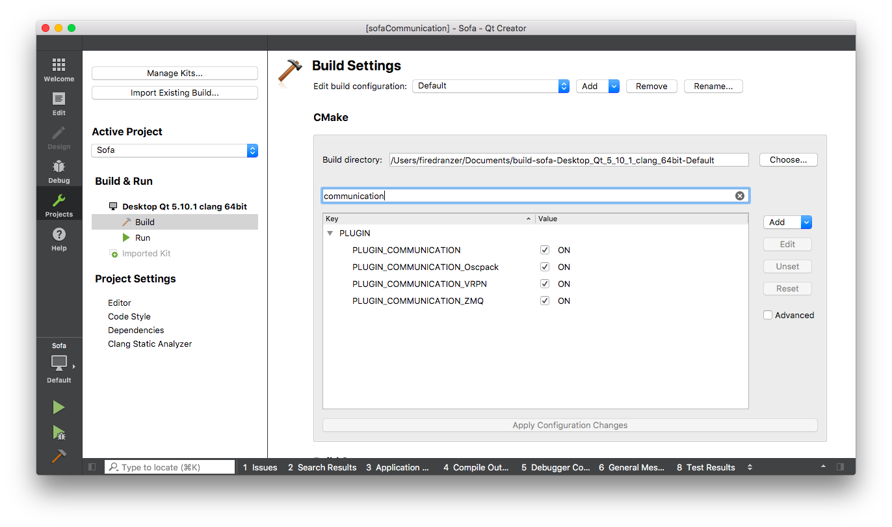

# VRPN 
This repo contains all my work that I did related to the GSOC project.

## Installing VRPN

* MacOS

```
$ brew install vrpn
```
To run the example
```
$ g++ test.cpp -lvrpn -lpthread
$ ./a.out
```

# QtCreator



# CMAKE-GUI Configuration


## How to Use ServerCommunication VRPN

Recieve

```
<ServerCommunicationVRPN name="vrpn1" job="receiver" address="localhost"/>
<CommunicationSubscriber name="sub1" communication="@vrpn1" subject="Mouse0" target="@light1" datas="aNewStringValue"/>
```

Sender

```
<ServerCommunicationVRPN name="vrpn1" job="sender" address="localhost"/>
<CommunicationSubscriber name="sub1" communication="@vrpn1" subject="Mouse0" target="@light1" datas="aNewStringValue"/>
```